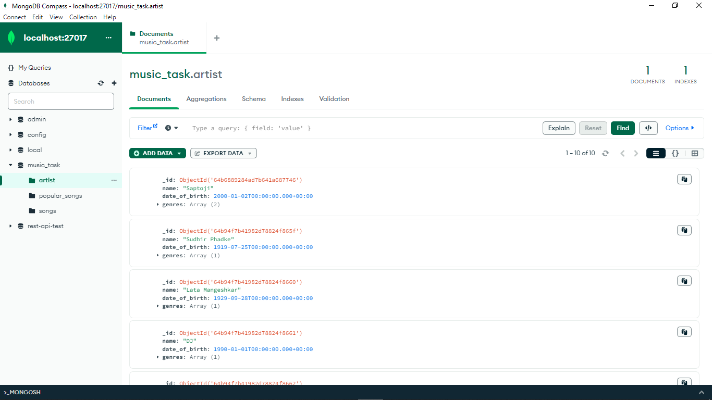
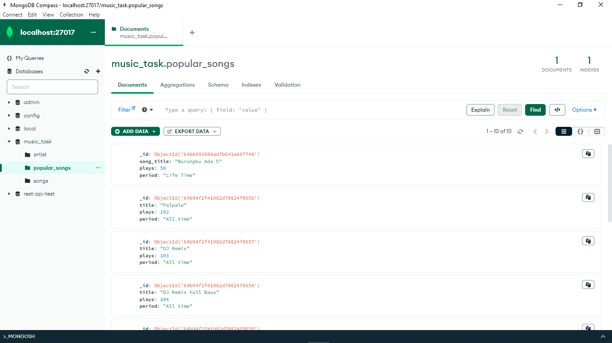
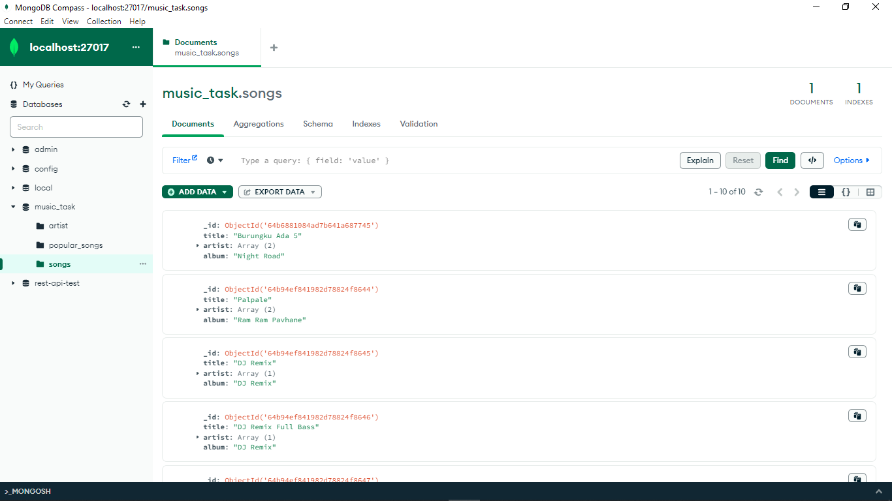

#### Start the MongoDB shell
`mongosh`

#### Create a new database called 'music-task'
`use music-task`

#### Create collections for songs, artist, and popular songs
```
db.createCollection('songs')
db.createCollection('artist')
db.createCollection('popular_songs')
```
#### Insert sample data into the collections
```
db.songs.insertMany([
      {
        title: "Burungku Ada 5",
        artist: ["Saptoji","John Doe"],
        album: "Night Road",
      },
      {
        title: "Palpale",
        artist: ["Sudhir Phadke", "Lata Mangeshkar"],
        album: "Ram Ram Pavhane",
      },
      {
        title: "DJ Remix",
        artist: ["DJ"],
        album: "DJ Remix",
      },
      {
        title: "DJ Remix Full Bass",
        artist: ["DJ"],
        album: "DJ Remix",
      },
      {
        title: "Rap God",
        artist: ["Eminem"],
        album: "The Marshall Mathers LP2",
      },
      {
        title: "Cars Outside",
        artist: ["Jordy Chandra"],
        album: "When The Sun Goes Down",
      },
      {
        title: "Lofi Hip Hop",
        artist: ["YouTube", "T-series"],
        album: "Mellow",
      },
      {
        title: "Lofi Bulan",
        artist: ["Gustixa"],
        album: "Gustixa Lofi",
      },
      {
        title: "Lofi Rain",
        artist: ["Gustixa"],
        album: "Gustixa Lofi",
      },
      {
        title: "Lofi Anime",
        artist: ["Gustixa"],
        album: "Gustixa Lofi Anime",
      },
    ]);
    
db.artist.insertMany([
      {
        name: "Queen",
        date_of_birth: new Date("1947-09-05"),
        genres: ["Rock"],
      },
      {
        name: "Sudhir Phadke",
        date_of_birth: new Date("1919-07-25"),
        genres: ["Classical"],
      },
      {
        name: "Lata Mangeshkar",
        date_of_birth: new Date("1929-09-28"),
        genres: ["Classical"],
      },
      {
        name: "DJ",
        date_of_birth: new Date("1990-01-01"),
        genres: ["Remix"],
      },
      {
        name: "Eminem",
        date_of_birth: new Date("1972-10-17"),
        genres: ["Hip Hop"],
      },
      {
        name: "Jordy Chandra",
        date_of_birth: new Date("1999-01-01"),
        genres: ["Lofi"],
      },
      {
        name: "YouTube",
        date_of_birth: new Date("2005-02-14"),
        genres: ["Lofi"],
      },
      {
        name: "T-series",
        date_of_birth: new Date("2006-03-13"),
        genres: ["Lofi"],
      },
      {
        name: "Gustixa",
        date_of_birth: new Date("1999-01-01"),
        genres: ["Lofi"],
      },
      {
        name: "Gustixa Lofi",
        date_of_birth: new Date("1999-01-01"),
        genres: ["Lofi"],
      },
    ]);
db.popular_songs.insertMany([
      {
        title: "Bohemian Rhapsody",
        plays: 101,
        period: "All time",
      },
      {
        title: "Palpale",
        plays: 102,
        period: "All time",
      },
      {
        title: "DJ Remix",
        plays: 103,
        period: "All time",
      },
      {
        title: "DJ Remix Full Bass",
        plays: 104,
        period: "All time",
      },
      {
        title: "Rap God",
        plays: 105,
        period: "All time",
      },
      {
        title: "Cars Outside",
        plays: 106,
        period: "All time",
      },
      {
        title: "Lofi Hip Hop",
        plays: 107,
        period: "All time",
      },
      {
        title: "Lofi Bulan",
        plays: 108,
        period: "All time",
      },
      {
        title: "Lofi Rain",
        plays: 109,
        period: "All time",
      },
      {
        title: "Lofi Anime",
        plays: 110,
        period: "All time",
      },
    ]);

```
#### Screenshots


